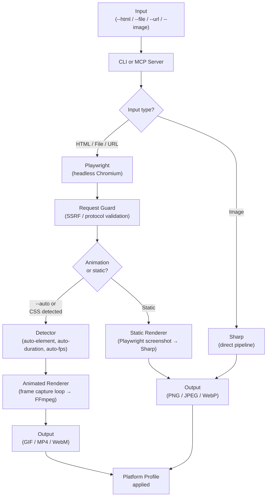

<div align="center">


# pixdom

**HTML in. Production assets out.**

Pixdom is a CLI tool and MCP server that helps developers and AI practitioners convert any HTML — inline, file, or URL — into platform-ready images and animations, without recording screens, opening Canva, or trimming videos by hand.

<br/>

[](https://www.npmjs.com/package/pixdom)
[](LICENSE)
[](https://github.com/sushilkulkarni1389/pixdom/commits/main)
[](https://github.com/sushilkulkarni1389/pixdom/stargazers)
[](https://github.com/sushilkulkarni1389/pixdom/actions)

</div>

---

<!--
  ⚠️  DEMO GIF — second thing to record before publishing.
  Suggested flow: run `pixdom convert --url https://your-demo-url.com --format gif --profile linkedin-post --auto`
  and show the terminal + the output GIF side by side. Use `vhs` or `asciinema` to record the terminal.
  Save to docs/assets/demo.gif, uncomment below.
-->
<!--  -->

> **Before you publish:** Record a 15-second terminal GIF showing `pixdom convert` turning an animated HTML file into a LinkedIn GIF. That single GIF will do more work than everything else in this README combined. Tools: [VHS](https://github.com/charmbracelet/vhs) or [Asciinema](https://asciinema.org/).

---

## What it does

You have HTML. Maybe Claude generated it, maybe you wrote it, maybe it's a URL. It has animations, or it doesn't. You need a PNG for a blog post, a GIF for a LinkedIn carousel, a MP4 for a Twitter post — at the exact pixel dimensions each platform expects.

Pixdom handles the whole pipeline in one command.

```bash
# Animated HTML → LinkedIn-ready GIF, auto-detected dimensions and duration
pixdom convert --file card.html --format gif --profile linkedin-post --auto --output ./card.gif

# URL → Twitter header image
pixdom convert --url https://myapp.com --profile twitter-header --output ./header.jpeg

# Grab just one element from a page
pixdom convert --file dashboard.html --selector "#chart" --format png --output ./chart.png
```

---

## Key highlights

- 🎞 **Animation-aware** — auto-detects CSS animation cycles, frame rates, and duration from the page itself. No manual `--duration` guessing required with `--auto`.
- 📐 **Platform profiles** — 22 presets covering LinkedIn, Twitter/X, and Instagram with correct dimensions, formats, and quality settings baked in. `--profile linkedin-post` just works.
- 🤖 **MCP server for Claude Code** — use Pixdom directly inside your Claude Code sessions. Generate HTML with Claude, render it as a production asset without leaving the terminal.
- 🎯 **Element-level capture** — `--selector "#card"` captures one DOM element pixel-perfectly, ignoring the rest of the page.
- 🛡 **Security-hardened** — SSRF protection, path traversal prevention, Chromium sandboxing on by default, temp file isolation. Documented in [SECURITY.md](.github/SECURITY.md).
- 📦 **Self-contained install** — one `npm install -g`, postinstall handles Chromium. No separate browser setup.

---

## The problem

Claude — and most AI coding assistants — generate HTML. Beautiful HTML, often with CSS animations that look great in a browser. The problem is that LinkedIn doesn't accept HTML. Neither does Twitter. Or your email newsletter, your slide deck, or your blog.

The manual path looks like this: open the file in Chrome → start a screen recording → wait for one full animation cycle → stop recording → open Canva → trim to exactly one loop → export as GIF → upload. That's six steps and about fifteen minutes of pure friction, every single time.

Pixdom started as a script to automate exactly that loop. It grew from there.

---

## Quick start

**Requirements:** Node.js 18+, npm or pnpm

```bash
# Install globally
npm install -g pixdom

# Chromium is installed automatically by postinstall.
# If it doesn't run automatically:
npx playwright install chromium

# Verify
pixdom --version
```

**Your first conversion:**

```bash
# Static image from a URL
pixdom convert --url https://example.com --format png --output ./out.png

# Animated HTML file → GIF with auto-detection
pixdom convert --file animation.html --format gif --auto --output ./out.gif
```

Shell completion (bash/zsh/fish):

```bash
pixdom completion --install
source ~/.bashrc   # or ~/.zshrc
```

---

## Usage examples

### 1. Generate a LinkedIn post image from a URL

```bash
pixdom convert \
  --url https://your-portfolio.com/project \
  --profile linkedin-post \
  --output ./linkedin.jpeg
```

`--profile linkedin-post` sets dimensions to 1200×1200, format to JPEG, and quality to platform spec automatically.

---

### 2. Convert an animated HTML file to a GIF for social

```bash
pixdom convert \
  --file hero-animation.html \
  --format gif \
  --auto \
  --output ./hero.gif
```

`--auto` detects the dominant animated element, measures the CSS animation cycle, and picks a sensible frame rate. No flags to guess.

If you need manual control:

```bash
pixdom convert \
  --file hero-animation.html \
  --format gif \
  --selector "#card" \
  --duration 3500 \
  --fps 24 \
  --output ./hero.gif
```

---

### 3. Use Pixdom inside Claude Code (MCP server)

Add to your `~/.claude.json`:

```json
{
  "mcpServers": {
    "pixdom": {
      "command": "node",
      "args": ["/path/to/pixdom/apps/mcp-server/dist/index.js"],
      "env": {
        "ANTHROPIC_API_KEY": "your-key-here"
      }
    }
  }
}
```

Then inside a Claude Code session:

```
Use pixdom to convert https://myapp.com to a linkedin-post JPEG. Save to ~/assets/linkedin.jpg.
```

Or with the generate tool (requires API key):

```
Use pixdom's generate tool to create an animated GIF LinkedIn post for:
"We just hit 1,000 users." Use profile linkedin-post, format gif, auto mode. Save to ~/post.gif.
```

---

### 4. Resize an existing image to a platform profile

```bash
pixdom convert \
  --image ./photo.jpg \
  --profile instagram-story \
  --output ./story.jpeg
```

`--image` bypasses Playwright entirely and uses Sharp directly — much faster for images that don't need rendering.

---

## Platform profiles

All 22 canonical profiles:

| Profile | Dimensions | Format |
|---|---|---|
| `linkedin-post` | 1200×1200 | JPEG |
| `linkedin-background` | 1584×396 | JPEG |
| `linkedin-article-cover` | 2000×600 | JPEG |
| `linkedin-profile` | 800×800 | JPEG |
| `linkedin-single-image-ad` | 1200×627 | JPEG |
| `linkedin-career-background` | 1128×191 | JPEG |
| `twitter-post` | 1600×900 | PNG |
| `twitter-header` | 1500×500 | JPEG |
| `twitter-ad` | 1600×900 | JPEG |
| `twitter-video` | 1600×900 | MP4 |
| `twitter-ad-landscape` | 800×450 | MP4 |
| `instagram-post-3-4` | 1080×1440 | JPEG |
| `instagram-post-4-5` | 1080×1350 | JPEG |
| `instagram-post-square` | 1080×1080 | JPEG |
| `instagram-story` | 1080×1920 | JPEG |
| `instagram-reel` | 1080×1920 | MP4 |
| `instagram-profile` | 320×320 | JPEG |
| `instagram-story-video` | 1080×1920 | MP4 |
| `square` | 1080×1080 | PNG |

---

## Architecture



**Key packages:**

| Package | Role |
|---|---|
| `@pixdom/core` | Playwright + Sharp + FFmpeg pipeline |
| `@pixdom/detector` | CSS animation cycle detection, auto-mode logic |
| `@pixdom/profiles` | Platform profile registry and resolution |
| `@pixdom/types` | Zod schemas, shared types, error codes |
| `apps/cli` | Commander.js CLI, progress reporting, error formatting |
| `apps/mcp-server` | MCP tools for Claude Code integration |

---

## Why not just use...

| Tool | What it does well | Where it falls short for this use case |
|---|---|---|
| **Playwright / Puppeteer (raw)** | Full browser control | You write the pipeline yourself every time. No animation detection, no platform profiles, no MCP integration. |
| **wkhtmltopdf / html2image** | Fast static screenshots | No animation support at all. No platform presets. |
| **Screen recording + Canva** | Works for one-offs | Not automatable. Not CI-friendly. Six manual steps per asset. |
| **Bannerbear / Placid** | Good SaaS option | Costs money, requires their template format, no HTML passthrough, no MCP. |
| **Sharp / FFmpeg directly** | Maximum control | Requires you to bring your own browser rendering layer and stitch the pieces together. That's what Pixdom already did. |

Pixdom's specific value is the combination: Playwright-accurate rendering + animation cycle detection + platform profile presets + MCP integration, as a single installable binary.

---

## Roadmap

The immediate priorities before a wider release:

- [ ] End-to-end verification of MP4 and WebM output formats
- [ ] Full execution of the [113-case test checklist](docs/test-checklist.md) across Linux, macOS, and Windows
- [ ] Publish to npm (`pixdom` package)

Planned for v2:

- [ ] Web UI — for teams who don't want CLI
- [ ] REST API — for integration into existing pipelines
- [ ] Job queue (BullMQ) — for high-volume rendering
- [ ] Cloud deployment guide (AWS)

If any of these are useful to you now, [open an issue](https://github.com/sushilkulkarni1389/pixdom/issues) and say so. Prioritization follows actual interest.

---

## Contributing

Contributions are welcome — code, documentation, bug reports, and testing feedback all count.

See [CONTRIBUTING.md](CONTRIBUTING.md) for development setup, branching conventions, and PR process.

Issues labeled [`good first issue`](https://github.com/sushilkulkarni1389/pixdom/issues?q=is%3Aissue+is%3Aopen+label%3A%22good+first+issue%22) are explicitly scoped for first-time contributors. The label means: "this is well-defined, has clear acceptance criteria, and I will review it promptly."

If you're using Pixdom for something interesting — even in a prototype — I'd genuinely like to hear about it. Open a [Discussion](https://github.com/sushilkulkarni1389/pixdom/discussions) or [drop me a note](https://github.com/sushilkulkarni1389).

---

## Community and support

- **GitHub Discussions** — questions, ideas, and show-and-tell: [github.com/sushilkulkarni1389/pixdom/discussions](https://github.com/sushilkulkarni1389/pixdom/discussions)
- **Bug reports** — [use the bug report template](https://github.com/sushilkulkarni1389/pixdom/issues/new?template=bug_report.md)
- **Feature requests** — [use the feature request template](https://github.com/sushilkulkarni1389/pixdom/issues/new?template=feature_request.md)
- **Security disclosures** — see [SECURITY.md](.github/SECURITY.md). Please do not open public issues for vulnerabilities.

---

## Built with

Pixdom was designed, written, and debugged with [Claude Code](https://claude.ai/code) — which is also what created the problem it solves. Claude generated the animated HTML. Claude helped build the tool to render it. There's a certain loop in there that felt worth acknowledging.

The pipeline itself runs on [Playwright](https://playwright.dev), [Sharp](https://sharp.pixelplumbing.com), and [FFmpeg](https://ffmpeg.org). The CLI is built with [Commander.js](https://github.com/tj/commander.js). The MCP server speaks the [Model Context Protocol](https://modelcontextprotocol.io).

---

## License

MIT — see [LICENSE](LICENSE).

---

<div align="center">

[](https://star-history.com/#sushilkulkarni1389/pixdom&Date)

<br/>

Made with ♥ in Pune, using Claude Code

</div>
