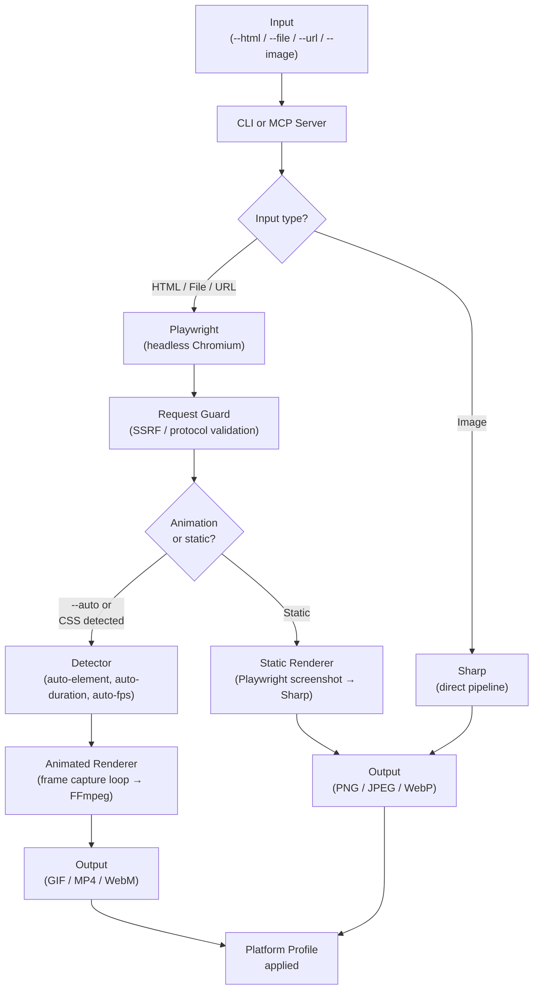

<div align="center">


# pixdom

**HTML in. Production assets out.**

Pixdom is a CLI tool and MCP server that converts any HTML — inline, file, or URL — into platform-ready images and animations, without recording screens, opening Canva, or trimming videos by hand.

<br/>

[](https://www.npmjs.com/package/pixdom)
[](LICENSE)
[](https://github.com/sushilkulkarni1389/pixdom/commits/main)
[](https://github.com/sushilkulkarni1389/pixdom/stargazers)

</div>

---


---

## What it does

You have HTML. Maybe Claude generated it, maybe you wrote it, maybe it's a URL. You need a PNG for a blog post, a GIF for a LinkedIn carousel, an MP4 for a Twitter post — at the exact pixel dimensions each platform expects.

Pixdom handles the whole pipeline in one command:

```bash
# Animated HTML → LinkedIn-ready GIF, auto-detected dimensions and duration
pixdom convert --file card.html --format gif --profile linkedin-post --auto --output ./card.gif

# URL → Twitter header image
pixdom convert --url https://myapp.com --profile twitter-header --output ./header.jpeg

# Capture a single element from a page
pixdom convert --file dashboard.html --selector "#chart" --format png --output ./chart.png

# Resize an existing image to a platform profile
pixdom convert --image ./photo.jpg --profile instagram-story --output ./story.jpeg
```

---

## Key highlights

- 🎞 **Animation-aware** — auto-detects CSS animation cycles, frame rates, and duration from the page itself. No manual `--duration` guessing required with `--auto`.
- 📐 **Platform profiles** — 19 canonical presets covering LinkedIn, Twitter/X, and Instagram with correct dimensions, formats, and quality settings baked in.
- 🤖 **MCP server for Claude Code** — use Pixdom directly inside Claude Code sessions. Generate HTML with Claude, render it as a production asset without leaving the terminal.
- 🎯 **Element-level capture** — `--selector "#card"` captures one DOM element pixel-perfectly, ignoring the rest of the page.
- 🛡 **Security-hardened** — SSRF protection, path traversal prevention, Chromium sandboxing on by default, MCP output sandboxing, OS keychain for API key storage. See [SECURITY.md](.github/SECURITY.md).
- 📦 **Self-contained install** — one command installs both the `pixdom` CLI and the `pixdom-mcp` server binary. Postinstall handles Chromium automatically.
- 🐚 **Shell autocomplete** — full three-layer completion in bash and fish. `pixdom convert --profile <TAB>` shows all 19 canonical slugs. After selecting a value, `<TAB>` shows remaining unused flags.

---

## The problem

Claude — and most AI coding assistants — generate HTML. Beautiful HTML, often with CSS animations. The problem is that LinkedIn doesn't accept HTML. Neither does Twitter, your email newsletter, your slide deck, or your blog.

The manual path looks like this: open the file in Chrome → start a screen recording → wait for one full animation cycle → stop recording → open Canva → trim to exactly one loop → export as GIF → upload. That's six steps and fifteen minutes of pure friction, every single time.

Pixdom started as a script to automate exactly that loop. It grew from there.

---

## Quick start

**Requirements:** Node.js 18+, npm

### Linux — one-time npm setup

By default, npm on Linux installs global packages to `/usr/lib` which requires `sudo`. Configure a user-local directory first — do this once:

```bash
mkdir -p ~/.npm-global
npm config set prefix ~/.npm-global
echo 'export PATH="$HOME/.npm-global/bin:$PATH"' >> ~/.bashrc
source ~/.bashrc
```

Skip this step on macOS — Homebrew-installed Node already uses a user-local prefix.

### Install

```bash
npm install -g pixdom

# Chromium is installed automatically by postinstall.
# If it doesn't run automatically:
npx playwright install chromium

# Verify both binaries are available
pixdom --version
which pixdom-mcp
```

**macOS — if `pixdom: command not found` after install:**
```bash
echo 'export PATH="$(npm config get prefix)/bin:$PATH"' >> ~/.zshrc && source ~/.zshrc
```

**Your first conversion:**

```bash
# Static image from a URL
pixdom convert --url https://example.com --format png --output ./out.png

# Animated HTML file → GIF with auto-detection
pixdom convert --file animation.html --format gif --auto --output ./out.gif
```

**Shell completion (bash/fish):**

```bash
pixdom completion --install
source ~/.bashrc
```

This auto-writes to your shell rc file. No manual editing needed.

---

## Usage examples

### 1. Generate a LinkedIn post image from a URL

```bash
pixdom convert \
  --url https://your-portfolio.com/project \
  --profile linkedin-post \
  --output ./linkedin.jpeg
```

`--profile linkedin-post` sets dimensions to 1200×1200, format to JPEG, and quality to 90 — no flags to guess.

---

### 2. Convert an animated HTML file to a GIF

```bash
# Auto mode — detects element, duration, and FPS from the page
pixdom convert \
  --file hero-animation.html \
  --format gif \
  --auto \
  --output ./hero.gif
```

`--auto` scores DOM elements by area and centrality, measures the CSS animation cycle, and picks a frame rate. Before rendering it prints a summary:

```
Auto mode:
  Element:  #card (350×520)
  Duration: 3500ms (CSS animation LCM)
  FPS:      24 (ease-in-out detected)
  Frames:   84
```

If you need explicit control:

```bash
pixdom convert \
  --file hero-animation.html \
  --format gif \
  --selector "#card" \
  --duration 3500 \
  --fps 24 \
  --output ./hero.gif
```

---

### 3. Render a localhost page during development

```bash
# Start your dev server, then:
pixdom convert \
  --url http://localhost:3000 \
  --format png \
  --output ./preview.png \
  --allow-local
```

`--allow-local` is required for localhost and private network URLs. It prints a security warning and is intended for development only.

---

### 4. Use Pixdom inside Claude Code (MCP server)

**Install and configure in one step:**

```bash
pixdom mcp --install
pixdom mcp --set-key sk-ant-...   # only needed for the generate tool
# Restart Claude Code, then run /mcp to verify
```

This writes the MCP config to `~/.claude.json` automatically. No manual JSON editing.

> **Note:** Run `pixdom mcp --install` from inside a Claude Code project directory to scope it to that project. Run it from your home directory (`cd ~`) to install globally across all projects.

**Then inside a Claude Code session:**

```
Use pixdom to convert https://myapp.com to a linkedin-post JPEG. Save to ~/assets/linkedin.jpg.
```

Or with HTML generation (requires API key):

```
Use pixdom's generate tool to create an animated GIF LinkedIn post for:
"We just hit 1,000 users." Use profile linkedin-post, format gif. Set auto to true. Save to ~/post.gif.
```

**Check your setup at any time:**

```bash
pixdom mcp --status
```

Output:
```
pixdom MCP server status:
  Config entry:    ✔ found in ~/.claude.json (global scope)
  Binary:          ✔ /usr/local/bin/pixdom-mcp
  API key:         ✔ stored in OS keychain
  Output dir:      ~/pixdom-output/
  Allowed inputs:  ~/pixdom-input/, ~/Downloads/, ~/Desktop/
  Claude Code:     restart required to apply any recent changes
```

---

### 5. Resize an existing image to a platform profile

```bash
pixdom convert \
  --image ./photo.jpg \
  --profile instagram-story \
  --output ./story.jpeg
```

`--image` bypasses Playwright entirely and uses Sharp directly — much faster when you don't need browser rendering.

---

## Full CLI reference

```
pixdom [options] [command]

Options:
  -V, --version         Output version number
  --no-color            Disable ANSI color in error output
  --no-progress         Disable progress spinner (bare path to stdout — scriptable)
  -h, --help            Display help

Commands:
  convert [options]     Render HTML, file, URL, or image to output asset
  completion [options]  Install shell completion (bash/fish)
  mcp [options]         Setup and manage the pixdom MCP server
```

```
pixdom convert [options]

Input (mutually exclusive, one required):
  --html <string>       Inline HTML string
  --file <path>         Local HTML file (.html/.htm only)
  --url <url>           Remote URL (http/https only)
  --image <path>        Local image file — bypasses browser entirely

Output:
  --output <path>       Output file path (default: ./pixdom-output.<format>)
  --format <fmt>        png | jpeg | webp | gif | mp4 | webm (default: png)
  --profile <slug>      Platform profile (sets width, height, format, quality)
  --quality <n>         Compression quality 0–100 (default: 90)

Dimensions:
  --width <n>           Viewport width in pixels (default: 1280, max: 7680)
  --height <n>          Viewport height in pixels (default: 720, max: 4320)
  --auto-size           Auto-detect content dimensions from page

Animation:
  --fps <n>             Frame rate for animated output (1–60)
  --duration <ms>       Animation cycle in ms (100–300000, overrides auto-detection)

Selection:
  --selector <css>      Capture a specific DOM element only
  --auto                Auto-detect element, duration, and FPS

Security:
  --allow-local         Allow localhost/private network URLs (dev only)
```

```
pixdom mcp [options]

  --install             Add MCP server entry to ~/.claude.json
  --uninstall           Remove pixdom MCP entry from ~/.claude.json
  --status              Show config, binary path, API key, output dir
  --set-key <key>       Save ANTHROPIC_API_KEY (OS keychain first, plaintext fallback)
```

---

## Platform profiles

19 canonical profiles. Pass any slug to `--profile`:

| Profile | Dimensions | Format |
|---|---|---|
| `linkedin-post` | 1200×1200 | JPEG |
| `linkedin-background` | 1584×396 | JPEG |
| `linkedin-article-cover` | 2000×600 | JPEG |
| `linkedin-profile` | 800×800 | JPEG |
| `linkedin-single-image-ad` | 1200×627 | JPEG |
| `linkedin-career-background` | 1128×191 | JPEG |
| `twitter-post` | 1600×900 | PNG |
| `twitter-header` | 1500×500 | JPEG |
| `twitter-ad` | 1600×900 | JPEG |
| `twitter-video` | 1600×900 | MP4 |
| `twitter-ad-landscape` | 800×450 | MP4 |
| `instagram-post-3-4` | 1080×1440 | JPEG |
| `instagram-post-4-5` | 1080×1350 | JPEG |
| `instagram-post-square` | 1080×1080 | JPEG |
| `instagram-story` | 1080×1920 | JPEG |
| `instagram-reel` | 1080×1920 | MP4 |
| `instagram-profile` | 320×320 | JPEG |
| `instagram-story-video` | 1080×1920 | MP4 |
| `square` | 1080×1080 | PNG |

Legacy aliases also work: `linkedin` → `linkedin-post`, `twitter` → `twitter-post`, `instagram` → `instagram-post-square`.

---

## MCP tools

Pixdom exposes two tools to Claude Code:

| Tool | What it does | API key needed? |
|---|---|---|
| `convert_html_to_asset` | Converts HTML, file, URL, or image to a platform asset using local Playwright | No |
| `generate_and_convert` | Asks Claude to write the HTML, then renders it | Yes (`pixdom mcp --set-key`) |

**API key storage:**
`pixdom mcp --set-key` tries your OS keychain first (macOS Keychain, Linux Secret Service, Windows Credential Locker). If unavailable, it falls back to plaintext in `~/.claude.json` with a warning and sets file permissions to 0o600. You can also set `ANTHROPIC_API_KEY` in your shell profile — pixdom will use it automatically.

**MCP security defaults:**

| Setting | Default | Override |
|---|---|---|
| Output directory | `~/pixdom-output/` | `PIXDOM_MCP_OUTPUT_DIR` env var |
| Allowed file input dirs | `~/pixdom-input/`, `~/Downloads/`, `~/Desktop/` | `PIXDOM_MCP_ALLOWED_DIRS` (colon-separated) |
| URL protocols | http/https only | — |
| Private IPs / localhost | Blocked | `--allow-local` flag |

---

## Environment variables

| Variable | Purpose | Default |
|---|---|---|
| `PIXDOM_NO_SANDBOX` | Disable Chromium sandbox (Docker/CI only) | off |
| `PIXDOM_MCP_OUTPUT_DIR` | MCP output directory | `~/pixdom-output/` |
| `PIXDOM_MCP_ALLOWED_DIRS` | MCP allowed input dirs (colon-separated) | `~/pixdom-input/:~/Downloads/:~/Desktop/` |
| `ANTHROPIC_API_KEY` | API key for `generate_and_convert` tool | — |

---

## Error messages

Pixdom uses structured error output for all failures:

```
✗ Unsupported file type
  What happened: "report.pdf" is not a supported input file type for --file
  How to fix:    --file accepts .html and .htm only. To convert an image use --image instead.
  Example:       pixdom convert --image report.pdf --format png --output ./out.png
  Docs:          --file, --image
```

All error output goes to stderr. Stdout always contains only the output file path — safe for piping and scripting.

---

## Architecture



**Key packages:**

| Package | Role |
|---|---|
| `@pixdom/core` | Playwright + Sharp + FFmpeg pipeline |
| `@pixdom/detector` | CSS animation cycle detection, auto-mode logic |
| `@pixdom/profiles` | Platform profile registry and resolution |
| `@pixdom/types` | Zod schemas, shared types, error codes |
| `apps/cli` | Commander.js CLI, progress reporting, shell completion |
| `apps/mcp-server` | MCP tools for Claude Code integration |

---

## Platform support

| Platform | Support | Notes |
|---|---|---|
| Linux | ✅ Full | Set up user-local npm prefix first — see [Quick start](#quick-start) |
| macOS | ✅ Full | Run `npm config get prefix` and add to PATH if `pixdom: command not found` |
| Windows WSL | ✅ Full | Copy tarball into WSL first: `cp /mnt/c/Users/.../pixdom-*.tgz ~/`. Access WSL home from Windows Explorer at `\\wsl$\Ubuntu\home\username` |
| Windows native | ⚠️ Partial | Conversion works, shell completion not supported (CMD/PowerShell) |

---

## Why not just use...

| Tool | What it does well | Where it falls short |
|---|---|---|
| **Playwright / Puppeteer (raw)** | Full browser control | You write the pipeline yourself every time. No animation detection, no platform profiles, no MCP integration. |
| **wkhtmltopdf / html2image** | Fast static screenshots | No animation support. No platform presets. |
| **Screen recording + Canva** | Works for one-offs | Not automatable. Not CI-friendly. Six manual steps per asset. |
| **Bannerbear / Placid** | Good SaaS option | Costs money, requires their template format, no HTML passthrough, no MCP. |
| **Sharp / FFmpeg directly** | Maximum control | Requires you to bring your own browser rendering layer and stitch the pieces together. That's what Pixdom already did. |

Pixdom's specific value is the combination: Playwright-accurate rendering + CSS animation cycle detection + platform profile presets + MCP integration, as a single installable binary.

---

## Known limitations

- Canvas and `requestAnimationFrame` animations require `--duration` manually — the detector only measures CSS-declared cycles
- `backdrop-filter: blur()` may not render correctly in Playwright headless mode
- Sites behind Cloudflare or bot-protection may fail with `Page failed to load` — this is a Cloudflare restriction, not a Pixdom bug. Workaround: `curl -s https://site.com > page.html && pixdom convert --file page.html`
- `pix<TAB>` binary name expansion not supported — type `pixdom` in full to trigger completion
- Shell completion works fully on bash and fish. zsh completion is functional but requires `autoload -Uz compinit && compinit` before the `source <(pixdom --completion)` line in `~/.zshrc`
- `pixdom-mcp` hangs waiting for stdin when run directly in a terminal — this is correct MCP behaviour; Claude Code launches it automatically
- MP4 and WebM output are implemented but not yet end-to-end verified across all platforms
- `PIXDOM_NO_SANDBOX=1` env var disables Chromium sandbox — use in Docker/CI only
- HTML syntax errors are silently fixed by Chromium and rendered as-is — Pixdom does not validate HTML content

---

## Roadmap

**v2:**

- [ ] Multi-tool MCP support — `pixdom mcp --install --tool gemini|codex|cursor|all`
- [ ] Full zsh completion parity with bash
- [ ] HTML content validation — warn when `--file` content doesn't look like HTML
- [ ] Web UI — for teams who don't want a CLI
- [ ] REST API — for integration into existing pipelines
- [ ] Job queue (BullMQ) — for high-volume rendering
- [ ] Cloud deployment guide (AWS)

If any of these are useful to you now, [open an issue](https://github.com/sushilkulkarni1389/pixdom/issues) and say so. Prioritization follows actual interest.

---

## Contributing

Contributions are welcome — code, documentation, bug reports, and testing feedback all count.

See [CONTRIBUTING.md](.github/CONTRIBUTING.md) for development setup, branching conventions, and PR process.

Issues labeled [`good first issue`](https://github.com/sushilkulkarni1389/pixdom/issues?q=is%3Aissue+is%3Aopen+label%3A%22good+first+issue%22) are explicitly scoped for first-time contributors — well-defined, clear acceptance criteria, prompt review.

---

## Community and support

- **GitHub Discussions** — questions, ideas, and show-and-tell: [github.com/sushilkulkarni1389/pixdom/discussions](https://github.com/sushilkulkarni1389/pixdom/discussions)
- **Bug reports** — [use the bug report template](https://github.com/sushilkulkarni1389/pixdom/issues/new?template=bug_report.md)
- **Feature requests** — [use the feature request template](https://github.com/sushilkulkarni1389/pixdom/issues/new?template=feature_request.md)
- **Security disclosures** — see [SECURITY.md](.github/SECURITY.md). Please do not open public issues for vulnerabilities.

---

## Built with

Pixdom was designed, written, and debugged with [Claude Code](https://claude.ai/code) — which is also what created the problem it solves. Claude generated the animated HTML. Claude helped build the tool to render it. There's a certain loop in there that felt worth acknowledging.

The pipeline runs on [Playwright](https://playwright.dev), [Sharp](https://sharp.pixelplumbing.com), and [FFmpeg](https://ffmpeg.org). The CLI is built with [Commander.js](https://github.com/tj/commander.js). The MCP server speaks the [Model Context Protocol](https://modelcontextprotocol.io).

---

## License

MIT — see [LICENSE](LICENSE).

---

<div align="center">

[](https://star-history.com/#sushilkulkarni1389/pixdom&Date)

<br/>

Made with ♥ in Pune, using Claude Code

</div>
